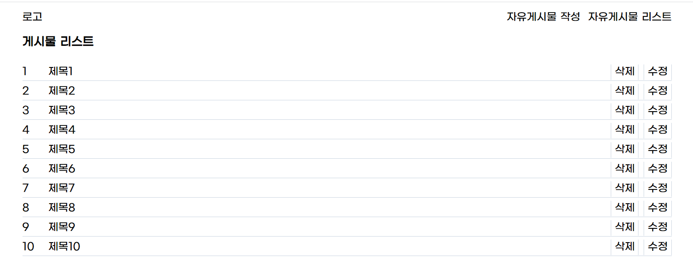
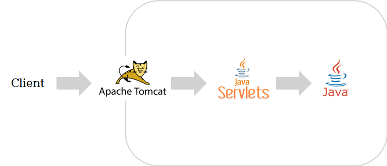

<!--
*** Thanks for checking out the Best-README-Template. If you have a suggestion
*** that would make this better, please fork the repo and create a pull request
*** or simply open an issue with the tag "enhancement".
*** Don't forget to give the project a star!
*** Thanks again! Now go create something AMAZING! :D
-->

<!-- PROJECT SHIELDS -->
<!--
*** I'm using markdown "reference style" links for readability.
*** Reference links are enclosed in brackets [ ] instead of parentheses ( ).
*** See the bottom of this document for the declaration of the reference variables
*** for contributors-url, forks-url, etc. This is an optional, concise syntax you may use.
*** https://www.markdownguide.org/basic-syntax/#reference-style-links
-->

<!-- PROJECT LOGO -->
 

<h3 align="center">Spring Legacy Project - articleList</h3>

  

    Spring Legacy Project - articleList
     
    <a href="https://github.com/kimdonghyeon3/tomcat_servlet"><strong>View Demo »</strong></a>
     
     

  

<!-- ABOUT THE PROJECT -->
## About The Project

Spring 이해를 위한 Tomcat Legacy Project (Tomcat + Servlet)
 
Spring 구조를 Tomcat, Servlet, Java를 통해 유사하게 구성한, 유사 Spring Project

(<a href="#top">back to top</a>)

<!-- GETTING STARTED -->
## Getting Started

본 프로젝트는 배포 없이 Local에서 작동합니다.

### 설치 방법

1. Tomcat Download
    
   http://tomcat.apache.org/

2. Setting -> Plugins -> SmartTomcat Install

3. Edit Configuration -> add new Configuration -> smart tomcat 
 
Tomcat Server : 다운받은 톰캣 위치
Deployment Dir.. : 자신 프로젝트의 src\webapp
4. Run

(<a href="#top">back to top</a>)

## Prject Structure

<!-- CONTACT -->
## Contact

Email - kimdonghyeon98@gmail.com

Project Link: [https://github.com/kimdonghyeon3/tomcat_servlet](https://github.com/kimdonghyeon3/escaperoom)

(<a href="#top">back to top</a>)

MIT License
Copyright (c) 2021 Othneil Drew

<!-- MARKDOWN LINKS & IMAGES -->
<!-- https://www.markdownguide.org/basic-syntax/#reference-style-links -->
[contributors-shield]: https://img.shields.io/github/contributors/github_username/repo_name.svg?style=for-the-badge
[contributors-url]: https://github.com/github_username/repo_name/graphs/contributors
[forks-shield]: https://img.shields.io/github/forks/github_username/repo_name.svg?style=for-the-badge
[forks-url]: https://github.com/github_username/repo_name/network/members
[stars-shield]: https://img.shields.io/github/stars/github_username/repo_name.svg?style=for-the-badge
[stars-url]: https://github.com/github_username/repo_name/stargazers
[issues-shield]: https://img.shields.io/github/issues/github_username/repo_name.svg?style=for-the-badge
[issues-url]: https://github.com/github_username/repo_name/issues
[license-shield]: https://img.shields.io/github/license/github_username/repo_name.svg?style=for-the-badge
[license-url]: https://github.com/github_username/repo_name/blob/master/LICENSE.txt
[linkedin-shield]: https://img.shields.io/badge/-LinkedIn-black.svg?style=for-the-badge&logo=linkedin&colorB=555
[linkedin-url]: https://linkedin.com/in/linkedin_username
[product-screenshot]: images/screenshot.png
